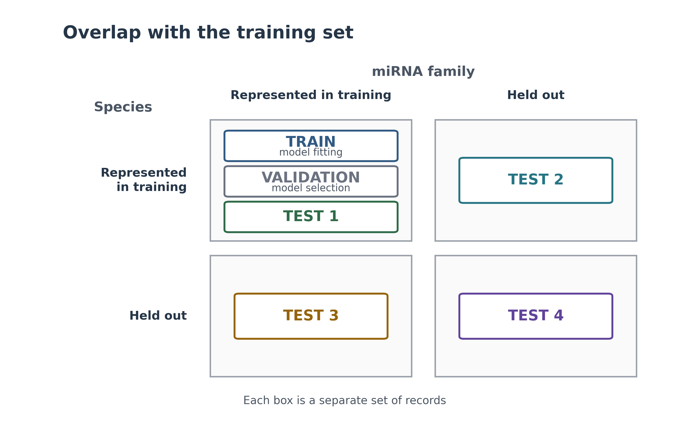

# Manuscript figures

`figure1_split_matrix.svg` and `figure1_split_matrix.png` place all six
pre-miRBench partitions in a 2 × 2 matrix according to their species and
miRNA-family overlap with training. All six partitions contain distinct records.



Test 2 and Test 4 each contain 59 held-out families. Fifteen families occur in
both tests, while 44 are unique to each test; their union therefore contains
all 103 families absent from training.

Recreate the figure with:

```bash
python figures/make_figure1_split_matrix.py
```
